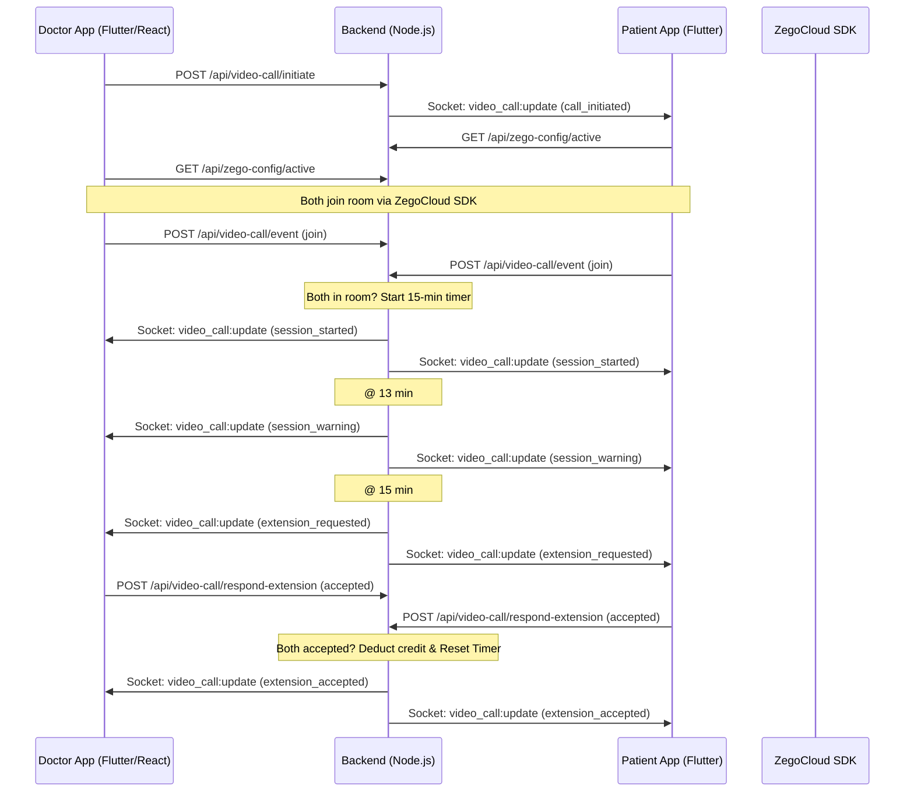

# Video Consultation Feature — Full Integration Guide

This document covers the complete end-to-end implementation of the ZegoCloud-powered video consultation system. It is specifically designed to help **Flutter Developers** integrate the feature flawlessly.

---

## 1. Architecture Overview



---

## 2. Key Rules & Behavior

1. **Timer Reset:** The 15-minute backend timer **restarts** if either party leaves and both rejoin. It only runs when **both** participants are actively in the room.
2. **Credit Deduction:** Credits are only deducted when **both** parties accept an extension request (after the 15-minute timer expires). Rejoining does **not** consume extra credits.
3. **Response Window:** When an extension is requested, participants have **90 seconds** to respond. If either rejects or the time expires, the call is automatically marked as `completed`.
4. **Room ID:** The `roomId` is always the `consultancyId`. Use this for both ZegoCloud and Backend API calls.

---

## 3. Flutter Integration Steps (Quick Start)

### Step 1: Socket Subscription
Before making any calls, the app must subscribe to its notification room to receive real-time updates (incoming calls, timers, etc.).
- **Event:** `notification:subscribe`
- **Payload:** `{ "userId": "YOUR_USER_ID", "userType": "User" }` (or "Doctor")

### Step 2: Fetch Zego Credentials
Do **not** hardcode `appID` or `serverSecret`. Fetch them dynamically.
- **Endpoint:** `GET /api/zego-config/active`
- **Use:** Pass these to the ZegoCloud SDK initialization.

### Step 3: Handle Incoming Call
Listen for the `video_call:update` socket event. If the payload `event` is `call_initiated`, show the "Incoming Call" screen.
- **Data Needed:** `roomId` (this is the unique ID for the Zego room).

### Step 4: Join & Report Event
Once the user enters the Zego room, you **must** notify the backend so the 15-minute timer can start.
- **Endpoint:** `POST /api/video-call/event`
- **Payload:** `{ "roomId": "...", "event": "join", "userId": "...", "userType": "..." }`

### Step 5: Monitor Timer & Extensions
Listen for `session_warning` (2 mins left) and `extension_requested` (timer ended).
- On `extension_requested`, show a dialog asking the user to extend.
- If they say yes, call `POST /api/video-call/respond-extension` with `response: "accepted"`.

---

## 3. Backend API Reference

### A. Zego Configuration
**`GET /api/zego-config/active`**
- **Purpose:** Get dynamic credentials for Zego SDK.
- **Auth:** None (Public)
- **Response:**
  ```json
  {
    "success": true,
    "config": {
      "appID": 123456789,
      "serverSecret": "your_secret_here",
      "appSign": "your_app_sign_here"
    }
  }
  ```

### B. Call Initiation (Doctor Only)
**`POST /api/video-call/initiate`**
- **Body:** `{ "consultancyId": "..." }`
- **Auth:** `Doctor Token`

### C. Event Logging (Crucial for Timers)
**`POST /api/video-call/event`**
- **Body:**
  ```json
  {
    "roomId": "...",
    "event": "join", // or "leave"
    "userId": "...",
    "userType": "User" // or "Doctor"
  }
  ```
- **Auth:** `Bearer Token` (Universal)

### D. Extension Flow
**`POST /api/video-call/respond-extension`**
- **Body:**
  ```json
  {
    "roomId": "...",
    "sessionIndex": 0, // Received from socket
    "response": "accepted", // or "rejected"
    "userType": "User"
  }
  ```

---

## 4. Real-time Socket Events
Listen to the `video_call:update` event on your socket instance.

| Event (`callData.event`) | Meaning | Action Needed |
|:---|:---|:---|
| `call_initiated` | Doctor started call | Show incoming call screen / Ringing |
| `session_started` | Both parties joined | Start 15-min UI countdown |
| `session_warning` | 13 mins passed | Show "2 minutes remaining" toast |
| `extension_requested` | 15 mins passed | Show "Extend for 15 mins?" dialog |
| `extension_accepted` | Both agreed | Reset UI countdown to 15:00 |
| `extension_rejected` | Either said no | Close call screen |
| `call_ended` | Manual hangup | Close call screen |

---

## 5. Database Schema (For Context)
The `VideoCall` record tracks everything. Key fields:
- `roomId`: The unique identifier for the Zego room.
- `status`: `initiated`, `ongoing`, `completed`.
- `sessions`: Array of 15-min blocks. Each block tracks if an extension was requested and accepted.

---

## 6. Common Troubleshooting

1. **Timer Not Starting:** Ensure **both** apps call `/api/video-call/event` with `event: "join"` immediately after entering the Zego room.
2. **Not Receiving Socket Updates:** Ensure you called `socket.emit("notification:subscribe", ...)` after the user logs in.
3. **401 Unauthorized:** Ensure the `Authorization: Bearer <token>` header is present in all requests.
